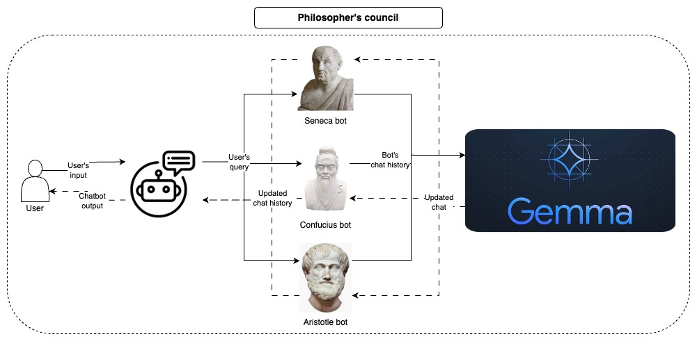
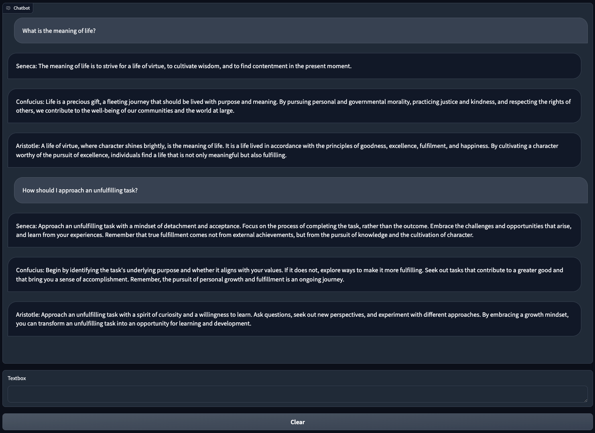

# Philosophers council

{project description}



# Demo



# Usage
The recommended approach to use this repository is with [Docker](https://docs.docker.com/), but you can also use a custom venv, just make sure to install all dependencies.

## Configs
```
model_id: google/gemma-1.1-2b-it
device: cpu
max_new_tokens: 128
prompts:
  seneca: prompts/seneca.txt
  confucius: prompts/confucius.txt
  aristotle: prompts/aristotle.txt
```
- **model_id:** Backend model used by the chatbot.
- **device:** Backend device used by the model, usually one of (cpu, cuda, mps).
- **max_new_tokens:** Maximum number of tokens generated by the model.
- **prompts:**
  - **bot_name:** Bot's initialization prompt (each bot should have one starting prompt).


## Commands

Start the Chatbot app.
```bash
make chatbot
```

Build the Docker image.
```bash
make build
```

Apply lint and formatting to the code (only needed for development).
```bash
make lint
```

# References
- [Gemma-1.1-2b-it HuggingFace model card](https://huggingface.co/google/gemma-1.1-2b-it)
- [Gemma Kaggle model card](https://www.kaggle.com/models/google/gemma)